  

-------
     

**ramannoodle** helps you calculate Raman spectra quickly and efficiency based on VASP calculations. **This software is currently being completely overhauled.** Check out the `legacy` branch for the old (and functional!) version.
